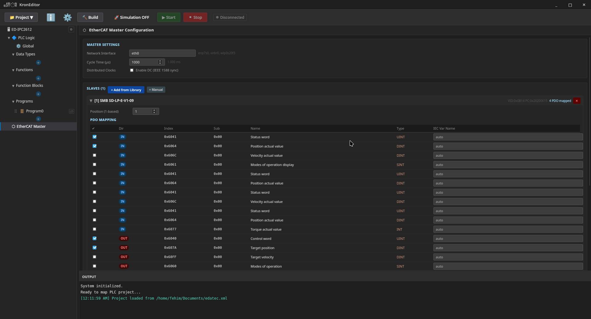

<p align="center">
  
</p>

<h1 align="center">KronEditor</h1>

<p align="center">
  <strong>Open-source IEC 61131-3 PLC IDE for real hardware.</strong><br>
  Design Ladder Diagrams visually, write Structured Text, compile to native C,<br>
  and run live simulations — all from a single desktop application.
</p>

<p align="center">
  
  
  
  
</p>

<p align="center">
  <a href="#-getting-started">Getting Started</a> ·
  <a href="#-features">Features</a> ·
  <a href="#-architecture">Architecture</a> ·
  <a href="#-simulation">Simulation</a> ·
  <a href="#%EF%B8%8F-ethercat-master">EtherCAT</a> ·
  <a href="#-standard-library">Standard Library</a> ·
  <a href="#-contributing">Contributing</a>
</p>

---

## ⚡ Turn Your Raspberry Pi Into a PLC

KronEditor runs on affordable hardware — Raspberry Pi, BeagleBone, Edatec IPC — or on any x86 Linux/Windows machine. Write IEC 61131-3 control logic, compile it to a native binary, deploy it, and watch variables update live from your laptop.

No proprietary runtime. No license fees. The compiled output is plain C.

---

## 🚀 Features

### Visual Ladder Diagram Editor
Drag contacts, coils, and function blocks onto rungs. Wire them together with automatic routing powered by React Flow. See energized paths turn **red** and de-energized paths turn **blue** in real time during simulation.

### Structured Text Editor
Full Monaco Editor (VS Code engine) with syntax highlighting for IEC 61131-3 ST. ST programs compile to C via a built-in transpiler that handles `IF/ELSIF/ELSE`, `FOR`, `WHILE`, `REPEAT/UNTIL`, and all standard operators.

### IEC 61131-3 Project Structure
- **Programs** — cyclic scan logic (LD or ST)
- **Function Blocks** — reusable stateful blocks
- **Functions** — stateless computation units
- **Data Types** — Array, Enum, Struct definitions
- **Resources & Tasks** — cycle-time scheduling, priority assignment

### Native Compilation — 6 Targets Out of the Box

| Target | Compiler | Output |
|--------|----------|--------|
| x86_64 Linux | GCC | ELF executable |
| x86_64 Windows | MinGW GCC | `plc.dll` |
| AArch64 Linux (Pi 3/4/5) | `aarch64-none-linux-gnu-gcc` | ELF executable |
| ARM Cortex-M0 | `arm-none-eabi-gcc` | Bare-metal binary |
| ARM Cortex-M4F | `arm-none-eabi-gcc` | Bare-metal binary |
| ARM Cortex-M7F | `arm-none-eabi-gcc` | Bare-metal binary |

Pre-compiled static libraries for all targets ship inside the application. Bundled GCC cross-compilers are downloaded automatically on first build.

### Real-Time Simulation with Live Variable Monitoring
Run the compiled program as a live process. Variable values update every 200 ms from actual process memory — not emulated, not approximated. Force-write any variable at runtime by clicking its value. The simulation is read-only for the editor: no accidental edits while the program runs.

**Linux:** Reads `/proc/PID/mem` via ELF symbol table resolution.
**Windows:** Loads `plc.dll` in-process via `LoadLibrary`/`GetProcAddress`.

### Watch Table
Add any expression to the watch table. Supports dot-notation (`Program1.myVar`). Inline-edit expressions. Invalid variables highlight in red — non-blocking, the simulation keeps running. Watch table entries are saved and restored with the project XML.

### EtherCAT Master
Built-in SOEM v2.0.0 integration. Configure slaves, map PDO entries, set up SDO init commands, and enable distributed clocks from a dedicated fieldbus editor. `libsoem.a` compiles from source automatically via *Settings → Libraries → Build SOEM*.

<p align="center">
  
</p>

### Board Configuration
Interactive pin maps for Raspberry Pi (3/4/5, Zero 2W, Pico), BeagleBone, and Edatec industrial IPCs. Inspect GPIO, I2C, SPI, and UART assignments. Digital I/O blocks map directly to physical hardware pins.

### CodeSys-Style Tab Interface
Every opened program, function block, function, data type, or fieldbus editor opens as a closable tab. Middle-click to close. Active tab stays visible with auto-scroll. Navigate the project tree and reopen any item at any time.

### Undo / Redo (50 steps)
Full undo/redo history across rung edits, variable changes, and block configuration. History snapshots include both the rung topology and the variable table together — no partial state.

### Internationalization
English · Turkish · Russian. Switch language in Settings without restarting.

---

## 🏗 Architecture

```
┌─────────────────────────────────────────────────────────────┐
│  React Frontend  (Vite + React + ReactFlow + Monaco)         │
│                                                             │
│  ProjectSidebar ──→ EditorTabs ──→ EditorPane               │
│       │                                  │                  │
│  VariableManager                 RungEditorNew (LD)         │
│  TaskManager                     Monaco Editor  (ST)        │
│  EtherCATEditor                  ResourceEditor             │
│  BoardConfigPage                 DataType Editors           │
│       │                                  │                  │
│       └──────────── CTranspilerService ──┘                  │
│                      LD + ST  →  C code                     │
│                      + variable symbol map                  │
└──────────────────────────┬──────────────────────────────────┘
                           │  Tauri IPC (invoke / event)
┌──────────────────────────▼──────────────────────────────────┐
│  Rust Backend  (Tauri v2)                                    │
│                                                             │
│  compile_simulation   →  GCC invocation                     │
│  run_simulation       →  spawn process + /proc/PID/mem      │
│  build_for_target     →  cross-compile + link               │
│  library commands     →  SOEM build, lib update             │
│                                                             │
│  ┌─────────────────────────────────────────────────────┐    │
│  │  Bundled Toolchains                                 │    │
│  │  MinGW  ·  arm-none-eabi  ·  aarch64-linux-gnu     │    │
│  └─────────────────────────────────────────────────────┘    │
└─────────────────────────────────────────────────────────────┘
```

### Repository Layout

```
src/
  components/           UI components
    RungEditorNew.jsx   Ladder editor shell (undo/redo, history)
    RungContainer.jsx   ReactFlow rung canvas
    VariableManager.jsx Variable table with live values
    EtherCATEditor.jsx  Fieldbus slave/PDO configurator
    OutputPanel.jsx     Console + Watch Table
    BoardConfigPage.jsx Hardware pin map viewer
    EditorTabs.jsx      CodeSys-style tab bar
  services/
    CTranspilerService.js  LD + ST → C transpiler
    LibraryService.js      Block definitions loader (XML)
    XmlService.js          Project save / load
    EsiParser.js           EtherCAT ESI file parser
  locales/              i18n (en / tr / ru)
  utils/
    libraryTree.js        Toolbox 3-level hierarchy
    boardDefinitions.js   Hardware board specs & pinouts

src-tauri/
  src/main.rs           Tauri commands (compile, simulate, build)
  src/ast.rs            Structured Text AST
  src/grammar.lalrpop   ST parser (LALRPOP)
  src/lexer.rs          ST lexer (Logos)

resources/
  include/              C headers (kronstandard.h, kroncontrol.h, …)
  arm/CortexM/{M0,M4,M7}/   Bare-metal static libraries
  arm/aarch64/               AArch64 Linux static libraries

public/libraries/       Block definitions (XML) loaded at runtime
scripts/
  download-toolchains.js  Downloads ARM & MinGW cross-compilers
```

---

## 🟢 Getting Started

### Prerequisites

| Tool | Version |
|------|---------|
| [Node.js](https://nodejs.org/) | 18+ LTS |
| [Rust](https://rustup.rs/) | stable |
| System libs | [Tauri v2 prerequisites](https://v2.tauri.app/start/prerequisites/) |

### Run in Development

```bash
git clone https://github.com/Krontek/KronEditor.git
cd KronEditor
npm install
npm run dev
```

The app window opens automatically with hot-reload.

### Build for Distribution

```bash
# Linux AppImage
npm run build:linux

# Windows NSIS installer (cross-compiled from Linux)
npm run build:windows

# Both platforms
npm run build
```

Cross-compilation toolchains (~1 GB) are downloaded automatically on first build and stored in `src-tauri/toolchains/`.

---

## 🔬 Simulation

1. Define variables in the **Variable Manager**
2. Build ladder rungs or write ST in the editor
3. Click **Start** — the program compiles and launches
4. Watch all variables update live in the Variable Manager
5. Click any value to **force-write** it at runtime
6. Add expressions to the **Watch Table** for focused monitoring
7. Press **Space** on a selected contact to toggle its variable instantly
8. Click **Stop** to terminate the process and resume editing

Ladder wires turn **red** when energized (TRUE) and **blue** when de-energized (FALSE), directly reflecting the running program's output pins.

---

## ⚙️ EtherCAT Master

KronEditor ships with a full EtherCAT master implementation powered by [SOEM v2.0.0](https://github.com/OpenEtherCATsociety/SOEM).

**Setup:**
1. *Settings → Libraries → Build SOEM* — compiles `libsoem.a` for your active target
2. *Project → Add Fieldbus → EtherCAT Master* — opens the master configuration editor
3. Attach slave devices, configure PDO mappings, add SDO init commands, enable distributed clocks
4. Use `EC_READ` / `EC_WRITE` blocks in your ladder programs to exchange data with slaves

**Supported targets:** x86_64 Linux · AArch64 Linux (Raspberry Pi 3/4/5)

> CANopen — coming soon 🚧

---

## 📦 Standard Library

60+ blocks implemented as C static libraries in the [KrontekLibraries](https://github.com/AKronfeld) repositories.

| Category | Blocks |
|----------|--------|
| **Timers** | TON, TOF, TP, TONR |
| **Counters** | CTU, CTD, CTUD |
| **Edge Detectors** | R_TRIG, F_TRIG |
| **Bistable Latches** | SR, RS |
| **Arithmetic** | ADD, SUB, MUL, DIV, MOD, ABS, SQRT, EXPT, MOVE |
| **Trigonometry** | SIN, COS, TAN, ASIN, ACOS, ATAN |
| **Comparison** | GT, GE, EQ, NE, LE, LT |
| **Selection** | SEL, MUX, MAX, MIN, LIMIT |
| **Bitwise / Shift** | BAND, BOR, BXOR, BNOT, SHL, SHR, ROL, ROR |
| **Type Conversion** | INT_TO_REAL, REAL_TO_INT, BOOL_TO_INT, INT_TO_BOOL, DINT_TO_REAL, … |
| **Scaling** | NORM_X, SCALE_X |
| **Motion** | MC_Power, MC_MoveAbsolute, MC_MoveRelative, MC_Stop, MC_Home |
| **Communication** | SEND, RECEIVE, MODBUS_READ, MODBUS_WRITE |
| **Advanced Control** | PID |

---

## 🤝 Contributing

KronEditor is under active development and welcomes contributions of all kinds:

- **Bug reports & feature requests** — Open an issue
- **Standard library blocks** — Add new blocks to the Krontek C libraries
- **New targets** — MCU architectures, RTOS integration, communication protocols
- **Structured Text** — The ST parser (LALRPOP + Logos) is functional but needs further work
- **Translations** — Improve existing languages or add new ones

```bash
npm run dev          # Start with hot-reload
npm run build:linux  # Build Linux AppImage
npm run build        # Build for all platforms
```

---

## License

[MIT](LICENSE) — Krontek, 2026
