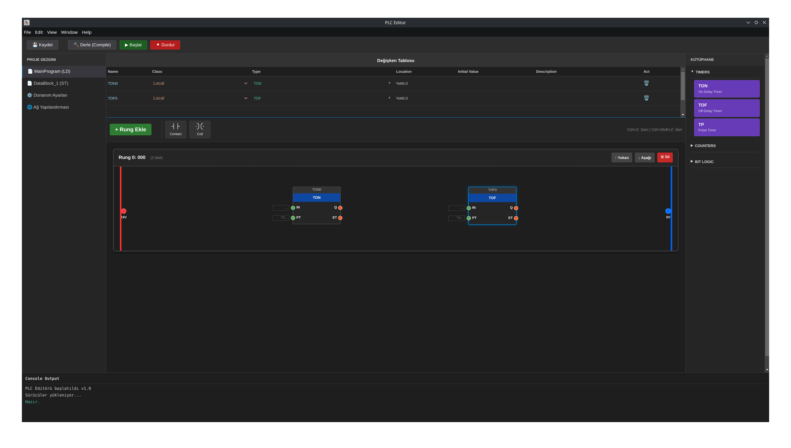

# Modern Web-Based PLC Editor


> A modern, modular, web-based Integrated Development Environment (IDE) designed for industrial automation, aiming to support IEC 61131-3 standards.

## 📖 About The Project

This project enables engineers and automation specialists to write, edit, and simulate PLC programs directly within a web browser. Built with **Vite** for speed, **TypeScript** for type safety, and **React** for a responsive user interface.

### Key Features

* ✅ **Structured Text (ST) Editor:** Powered by Monaco Editor (VS Code core), featuring syntax highlighting, intellisense, and auto-completion.
* 🔄 **Modular Architecture:** Component-based design for easy scalability.
* 🚧 **Visual Programming (Planned):** Drag-and-drop interface for Function Block Diagram (FBD) and Ladder Logic (LD) using React Flow.
* 🚧 **Real-Time Connectivity (Planned):** Live data exchange with PLCs via OPC UA or Modbus TCP.

<p align="center">
  
</p>

## 🛠️ Tech Stack

* [React](https://react.dev/) - UI Library
* [TypeScript](https://www.typescriptlang.org/) - Static Type Checking
* [Vite](https://vitejs.dev/) - Next Generation Frontend Tooling
* [Node.js & npm](https://nodejs.org/) - Runtime & Package Management

---

## 🚀 Getting Started

This project is cross-platform and works seamlessly on **Windows, macOS, and Linux**.

### Prerequisites

Before you begin, ensure you have the following installed on your machine:

* **Node.js** (LTS version recommended - v18.x or higher)
* **npm** (comes bundled with Node.js)

### 1. Clone the Repository

Open your terminal (Command Prompt, PowerShell, or Terminal) and clone the source code:

```bash
git clone [https://github.com/yourusername/plc-editor-project.git](https://github.com/yourusername/plc-editor-project.git)
cd plc-editor-project