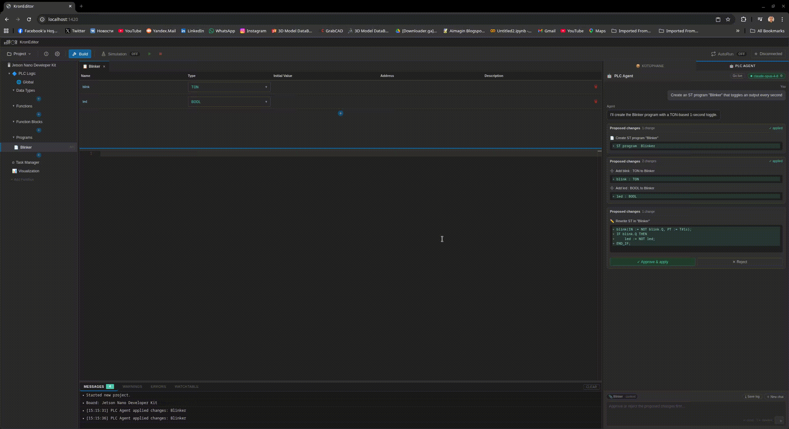

<p align="center">
  
</p>

<h1 align="center">KronEditor</h1>

<p align="center">
  <strong>A Virtual PLC Editor with a built-in PLC Agent.</strong><br>
  Describe the logic. The agent writes the Ladder & Structured Text.<br>
  Compile to native C. Run it. Ship it to real hardware.
</p>

<p align="center">
  
  
  
  
  
</p>

---

> ### We are actively looking for contributors and development partners.
> KronEditor is ambitious in scope — an AI PLC agent, a real-time runtime, online code-swap, an EtherCAT master, motion control, multi-target compilation. If you work in industrial automation, embedded systems, or compiler/LLM tooling and want to build something serious, **reach out or open a PR.**

---

## What is KronEditor?

KronEditor is an open-source, browser-native PLC IDE that targets **real industrial hardware** — not a simulator, not a toy. You write IEC 61131-3 logic in Ladder Diagram or Structured Text, it compiles to a native binary via **Clang/LLVM**, and it runs on the device.

The frontend runs in your browser; a single self-contained **Go agent** does the file I/O, compilation, simulation, and deployment. No Electron, no proprietary runtime, no license fees — the compiled output is plain C.

## ✨ The PLC Agent

A real tool-calling AI that **edits your project for you** — not a chat stub:

- **Authors logic** — creates POUs, writes Structured Text, draws Ladder, adds/updates variables (local & global)
- **Every change is a diff you approve** before it touches the project — nothing is applied behind your back
- **Reads the live machine** — streams running variables and diagnoses behavior (oscillating / stuck / drifting)
- **Pushes online changes** — with a live "Go live" session it hot-swaps your edits into the running PLC, state preserved
- **Your model, your choice** — Anthropic **Claude** (API key *or* "Sign in with your Claude account"), **Google Gemini**, any **OpenAI-compatible** endpoint, or fully **local models via Ollama** (one-click download & run, no cloud)

## Features

- **Visual Ladder Diagram editor** — drag contacts, coils, function blocks; live wire coloring during simulation
- **Structured Text editor** — Monaco (the VS Code engine) with full IEC 61131-3 syntax, validation & live value badges
- **Clang/LLVM compilation** — bundled toolchain; targets x86_64 and AArch64 / ARM (Raspberry Pi, Jetson, BeagleBone)
- **Live simulation** — your program runs as a real native process; variables update from actual process memory; force-write any variable at runtime
- **Hot-swap (online change)** — change logic while the PLC keeps running; timers, counters and latches survive the swap
- **EtherCAT Master** — configure slaves, PDO mappings, SDO init, distributed clocks
- **Motion Control** — PLCopen blocks: `MC_Power`, `MC_MoveAbsolute`, `MC_MoveRelative`, `MC_Stop`, `MC_Home`, …
- **Build & Send to hardware** — cross-compile and deploy over SSH to a target running the KronServer agent, with HMI serving and a token-secured REST API
- **60+ standard library blocks** — Timers, Counters, Edge Detectors, Math, Trig, Comparison, Bitwise, Type Conversion
- **i18n** — English · Turkish · Russian

## Getting Started

### Prerequisites

| Tool | Version | Notes |
|---|---|---|
| [Go](https://go.dev/dl/) | 1.21+ | builds & runs the host agent |
| [Node.js](https://nodejs.org/) | 18+ | frontend (Vite + React) |
| [Python](https://www.python.org/) | 3.8+ | `setup_toolchain.py` fetches Clang + sysroots |

> **Platform note:** the editor, compilation, and Build & Send work on **Linux and Windows**. Local *simulation* (running the compiled binary on your machine) is **Linux-only** — deployment to a Linux target works from either OS.

### Run (development)

```bash
git clone https://github.com/Krontek/KronEditor.git
cd KronEditor
npm install
npm run dev          # Vite on :1420 + Go agent on :7171
```

Open **http://localhost:1420**. The LLVM/Clang toolchains + target sysroots download automatically on first compile.

### Build (single self-contained binary)

```bash
npm run build                       # frontend (embedded) + Go agent → ./dist-binary/
./packaging/build-appimage.sh       # → KronEditor-x86_64.AppImage   (Linux)
./packaging/build-windows.sh        # → portable KronEditor zip       (Windows)
```

The resulting binary embeds the whole React app and serves everything on `:7171` — just run it and open the printed URL.

## Architecture

A React + ReactFlow + Monaco frontend runs in the browser. A single **Go host agent** (`host-agent/`) serves the embedded app and handles file I/O, bundled-Clang compilation, simulation (spawns the binary, reads `/proc/<pid>/mem`, streams live values over SSE), and SSH deployment. `CTranspilerService.js` transpiles Ladder and Structured Text to C, which Clang/LLVM compiles against pre-built static libraries. The **PLC Agent** is provider-agnostic and proxied through the agent so your API keys never leave your machine.

## License

[MIT](LICENSE) — Krontek, 2026
